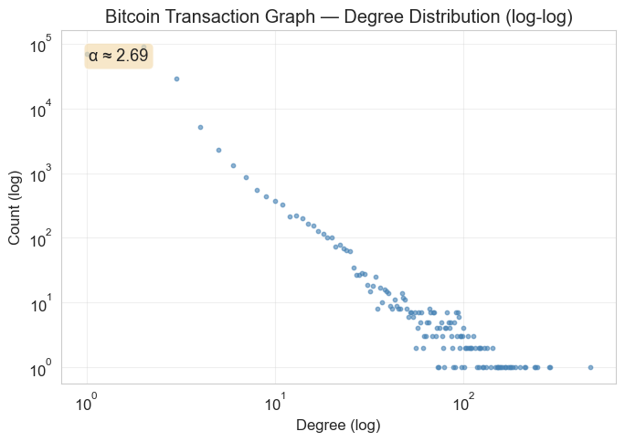
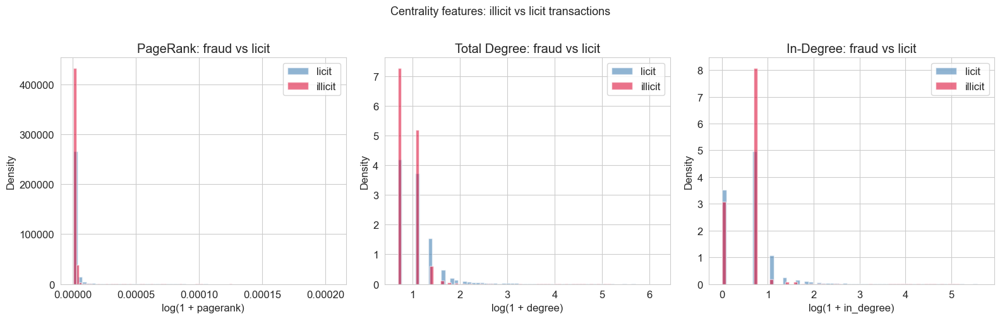
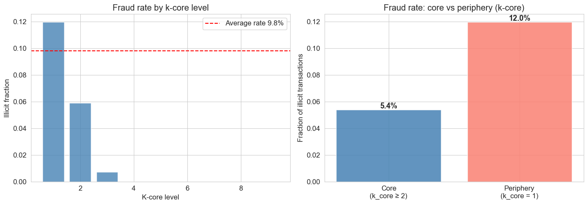
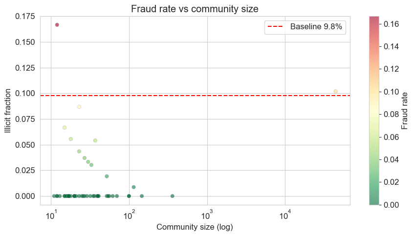
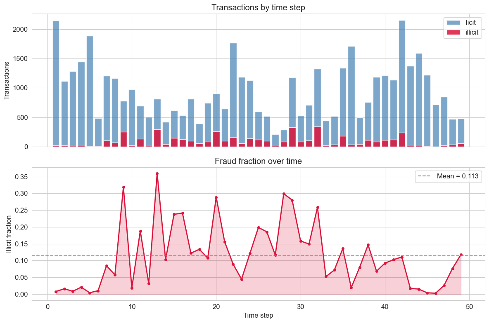

# Checkpoint 2 — EDA + Data
**Course:** Social Network Analysis, HSE  
**Student:** Nikita Tukhlin

---

## Data Status

✅ Dataset loaded and verified:
- 203 769 transactions, 234 355 edges, 49 timesteps
- Labels: 4 545 illicit (9.8%), 42 019 licit, 157 205 unknown
- Graph built with NetworkX: 49 connected components, largest — 7 880 nodes (3.9%)

---

## Key EDA Findings

### 2.1 Degree Distribution
- Degree distribution follows a power law
- Exponent α ≈ **2.69** (MLE Clauset-Newman-Shalizi, x_min = 1) — within the typical real-network range [2, 3]
- Visible only on a log-log scale

### 2.2 Centrality — fraud vs licit

| Metric | Ratio (fraud/licit) | p-value |
|---|---|---|
| Degree | 0.650 | p < 0.001 *** |
| In-degree | 0.665 | p < 0.001 *** |
| Out-degree | 0.625 | p < 0.001 *** |
| PageRank | 0.718 | n.s. |
| Betweenness | 0.001 | p < 0.001 *** |

**Finding:** Fraud nodes have degree ~1.5× lower than licit nodes. Fraudulent transactions concentrate at the network periphery and almost never act as bridges.

### 2.3 K-core Decomposition

| K-core | Fraud rate |
|---|---|
| k = 1 (periphery) | **12.0%** |
| k = 2 | 5.9% |
| k ≥ 3 | ~0% |

Fraud nodes are not embedded in the dense network core.

### 2.4 Community Detection (Louvain)
- 73 communities found (in the largest connected component)
- Fraud rate varies from 0% to 16.7% across communities → community label carries predictive signal

### 2.5 Temporal Analysis
- Fraud rate is unstable: from 0.3% to 36% across timesteps
- Fraud rate in train (11.2%) >> test (6.4%) → domain shift
- **Critical:** train/test split is done by time (temporal split), not randomly

---

## H1 Confirmed

Hypothesis H1 is confirmed at this stage:
- Degree, in-degree, out-degree, betweenness — all p < 0.001
- Fraud nodes are statistically significantly different from licit nodes in all topological metrics

---

## Next Steps

- [x] Data downloaded and verified
- [x] EDA completed
- [ ] Baseline models (LR, CatBoost)
- [ ] Feature engineering (graph features)
- [ ] GraphSAGE
